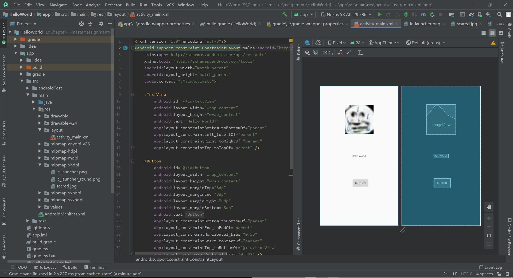
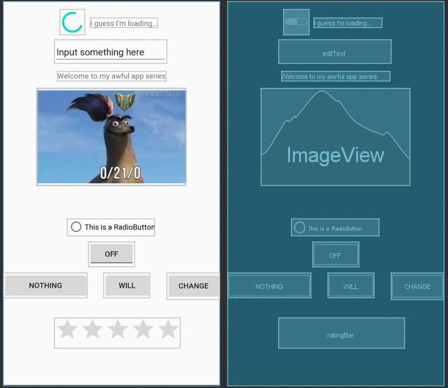
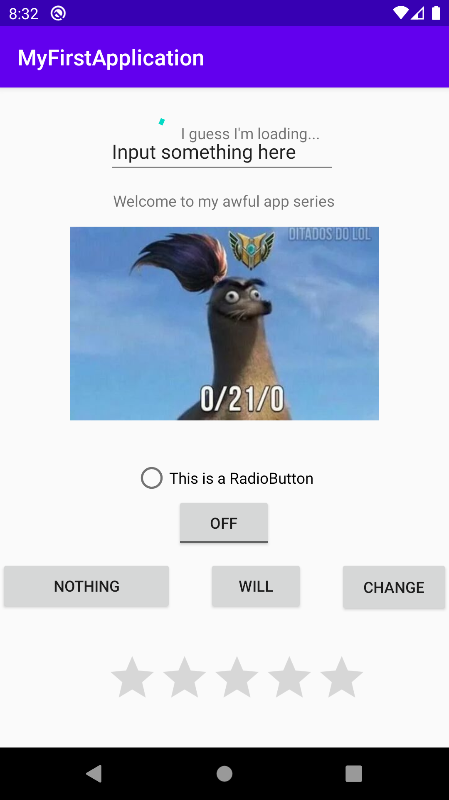
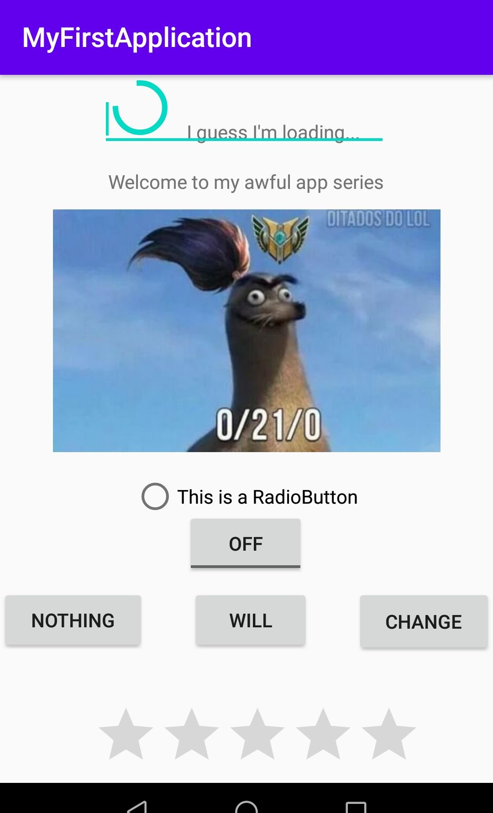
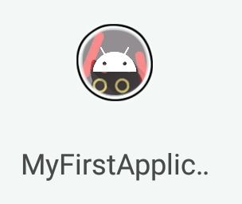

# Mobile Internet (android part) Chapter1 assignment

BUPT Mobile Internet Course android part chapter1

Android Studio 的配置环境

- Android Studio：3.6.1
- Gradle：5.6.4
- Gradle Plugin：3.6.1

## 1. 运行demo程序

经历了无数次gradle的bug，重装N次3.6无奈换上3.5，bug依旧，又升回3.6。

三天两夜，翻遍StackOverflow和CSDN之后终于神奇地修好了所有神奇的bug（包括但不限于：证书问题、sdk损坏、gradle版本问题、内置Kotlin无法使用、gradle报错get不到resource但可以用浏览器点进去下载等）

终于成功运行了demo程序（哭了

并加了一个ImageView进去：

## 2.创建Android工程并使用不同的view

自己创建了一个工程并且在layout中加了几个不同的组件，并改了icon预览图如下

运行虚拟机（Nexus 5X），效果如下：

打包apk发送到手机（Android 8）安装后效果如下

icon效果:

## 3. 使用其他Android开发工具

试用了sdk中platform文件夹下的adb工具

运行程序时查看了Android Studio 中的logcat工具